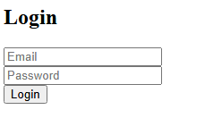
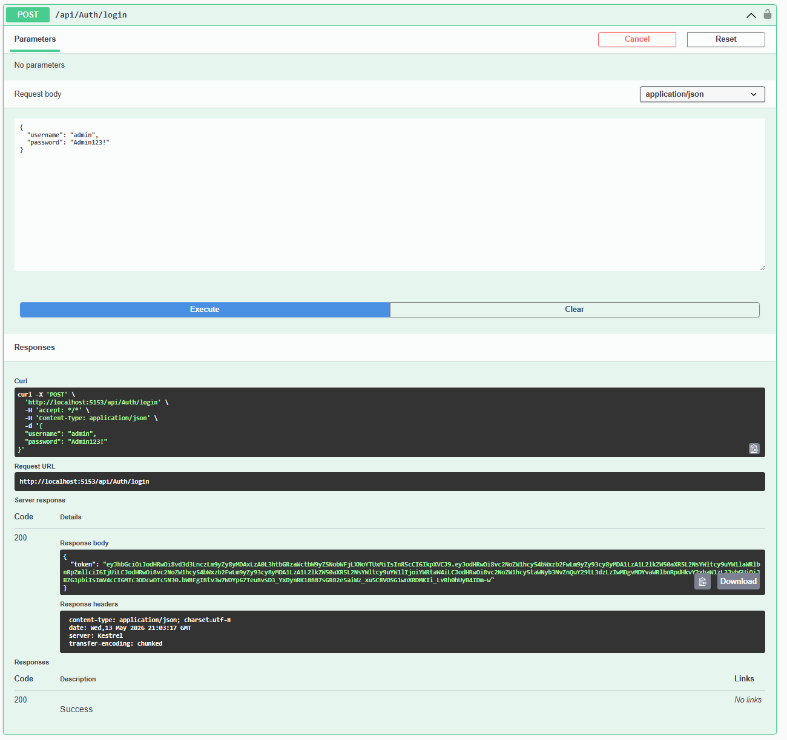
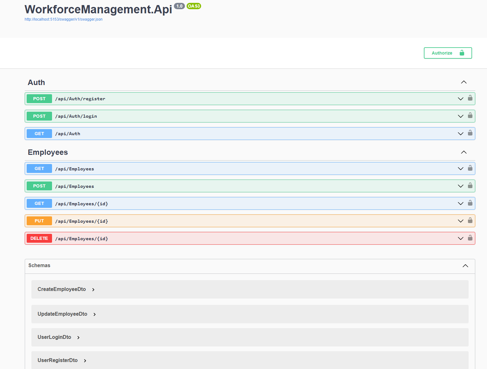
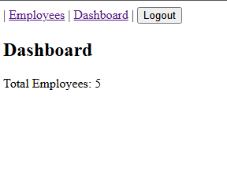
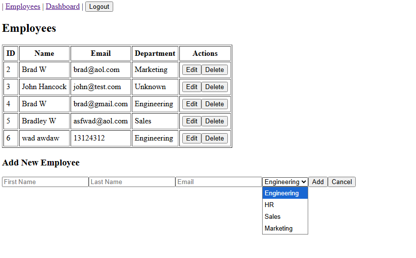

# Workforce Management Employee Portal

A full-stack employee management system built using Angular, ASP.NET Core Web API, and SQL Server.  
The project includes JWT authentication, role-based authorization, and full CRUD operations for employee management.

---

## Tech Stack

Frontend:

- Angular 19.2.21
- TypeScript
- HTML
- CSS

Backend:

- ASP.NET Core Web API (.NET 8)
- Entity Framework Core
- JWT Authentication
- HMACSHA512 password hashing

Database:

- Microsoft SQL Server

---

## Features

- User authentication (login/register)
- JWT token-based authentication
- Role-based authorization (Admin/User)
- Employee CRUD operations
- Secure password hashing with salt
- REST API architecture
- Swagger API testing interface

---

## Default Admin Login

Username: admin  
Password: Admin123!

---

## How to Run the Project

### Backend (.NET API)

Navigate to backend folder:

cd back-end

Run the API:

dotnet run

Backend will run on:
http://localhost:5153

Swagger UI:
http://localhost:5153/swagger

---

### Frontend (Angular)

Navigate to frontend folder:

cd front-end

Install dependencies:

npm install

Run Angular app:

ng serve

Frontend runs on:
http://localhost:4200

---

## Authentication Flow

1. Open Swagger or Angular frontend
2. Login using admin credentials
3. A JWT token will be returned
4. Copy token
5. Click Authorize in Swagger
6. Enter:
   Bearer YOUR_TOKEN_HERE
7. Access protected endpoints

---

## Database Configuration

The connection string in appsettings.json is local-only:

"ConnectionStrings": {
"DefaultConnection": "Server=BRADLEY-PC\\SQLEXPRESS;Database=WorkforceDb;Trusted_Connection=True;TrustServerCertificate=True;"
}

This must be changed for other users depending on their local SQL Server setup.

---

## Notes

- Database is managed using Entity Framework Core
- Passwords are hashed and salted using HMACSHA512
- JWT key is stored in appsettings.json for development purposes
- Admin user is seeded automatically if database is empty

---

## Future Improvements

- Deploy backend to cloud (Azure / Render)
- Deploy frontend (Vercel / Netlify)
- Add pagination and search for employees
- Improve UI/UX design
- Add refresh token authentication

---

## Author

Full-stack project demonstrating authentication, CRUD operations, and API integration using modern web development technologies.

## Screenshots

### Login Page

### Backend Login (Swagger Auth)

### Backend Overview

### Frontend Dashboard

### Employee Table

